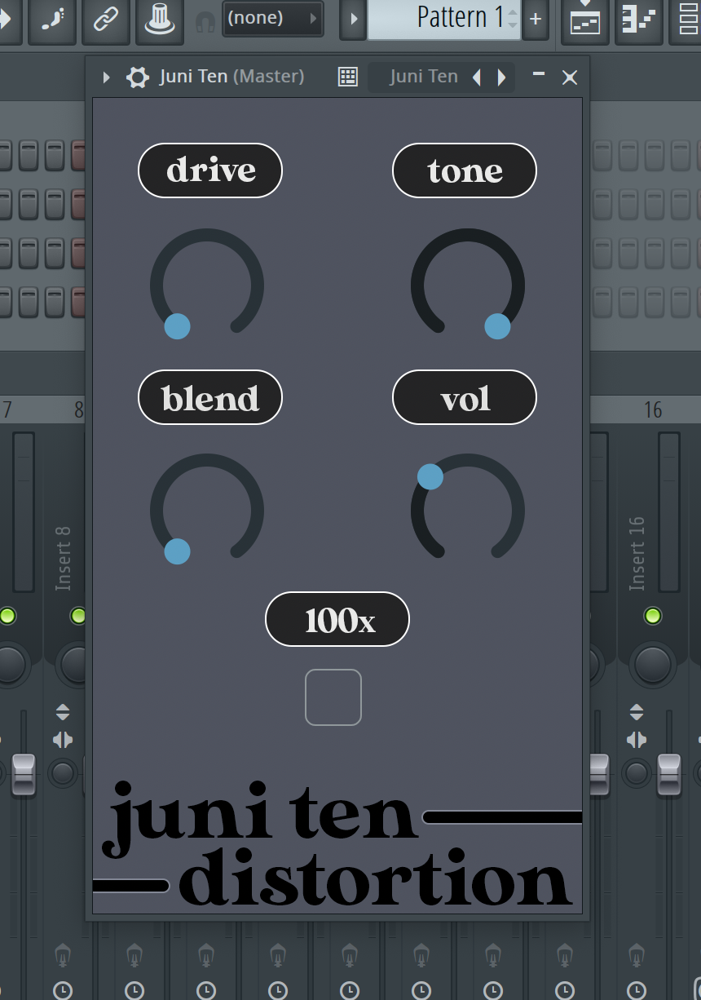

# engineering notebook

### Clipped Assignment Due 10/16
This assignment I created and wrote 2 sin wave file, as well as played one of them.

This was straightforward as I used Python and followed the recommendations in the canvas assingment.

The only thing that I was stuck on for a bit was I forgot to add this `sd.wait()` after my  
`sd.play(audio_clipped / 32768.0, sample_rate)`. So at first my audio did not play

### FFT / Adaptive tone control
I first just tried to grab the frequencies for me to see first, then i attempted to make the frequencies more equal. 
The sample that I had previously recorded (my_amazing_loop.wav) had a lot of saturation and warm tones to it, so it was easy to know if I was going in the right direction (start to remove the heavy lows)

I used the audio length as the window for the fft, but I will experiment more as the canvas description encourages. I am thinking of trying to compress the audio next, or apply it before the eq. Here is a dsp overflow [link](https://dsp.stackexchange.com/questions/10536/help-implementing-audio-dynamic-range-compression?noredirect=1&lq=1) I've been looking at for a simple implementation.

Anyways I will be experimenting more, for tonight I will leave off with an image of my terrible vst that I made freshmen/sophomore year. I didn't even really know what the knobs should have done

