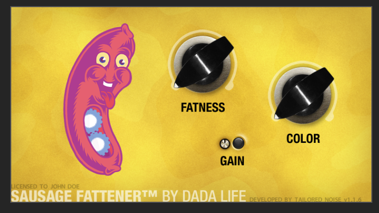

# engineering notebook

### Clipped Assignment Due 10/16
This assignment I created and wrote 2 sin wave file, as well as played one of them.

This was straightforward as I used Python and followed the recommendations in the canvas assingment.

The only thing that I was stuck on for a bit was I forgot to add this `sd.wait()` after my  
`sd.play(audio_clipped / 32768.0, sample_rate)`. So at first my audio did not play

### FFT / Adaptive tone control
I first just tried to grab the frequencies for me to see first, then i attempted to make the frequencies more equal. 
The sample that I had previously recorded (my_amazing_loop.wav) had a lot of saturation and warm tones to it, so it was easy to know if I was going in the right direction (start to remove the heavy lows)

I used the audio length as the window for the fft, but I will experiment more as the canvas description encourages. I am thinking of trying to compress the audio next, or apply it before the eq. Here is a dsp overflow [link](https://dsp.stackexchange.com/questions/10536/help-implementing-audio-dynamic-range-compression?noredirect=1&lq=1) I've been looking at for a simple implementation.

Anyways I will be experimenting more, for tonight I will leave off with an image of my terrible vst that I made freshmen/sophomore year. I didn't even really know what the knobs should have done

### JUCE Plugins
For my class project I am thinking of making another JUCE vst. I heard you mentioned we will be learning about JUCE a bit, so I will be excited for that.

Now there are a lot of options I can strive for, there are so many VSTS to choose from and play with that sometimes it is more fun than actually making music. Over the past years of messing around on DAWS, I have noticed a love/hate thing for a few VSTs in particular. These VSTS from what I can see have an ultra simple UI, but people seem to love the results they can get from them. Some examples on top of my head are Fl Studio's Soundgoodizer and Dada Life's Sausage Fattener.

From what it seems so far, audio programming can get complicated, and I can see how certain VSTs can get complicated visually to support that. But I have always read and seen people loving the basically neutered controls and UI of these VSTs. 

For both of these VSTs I think they do some sort of compression + reverb/saturation for Soundgoodizer and Sausage Fattener respectively. 

Anyways, for my project I am thinking of making a simple GUI 1-2 control VST, but try to make the backend as interesting as I can. Thinking of having some thresholds based on knob percentage that could make more drastic changes, things of that nature. 

With JUCE I need to develop it in xcode but i am saving my source files in this repo. I have the starter files up today.